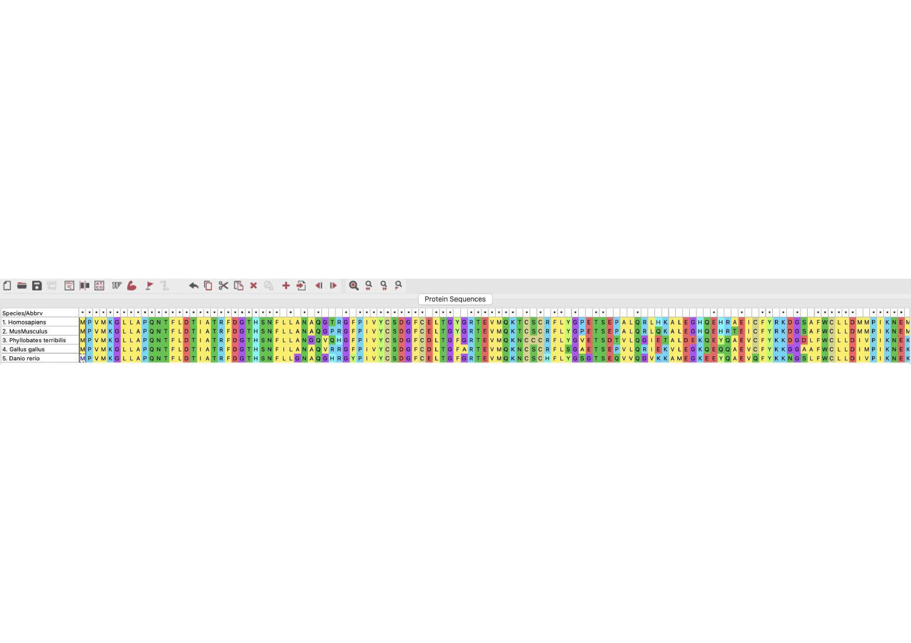
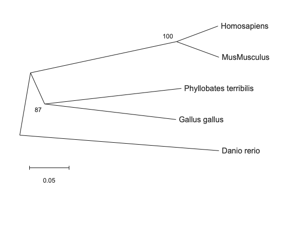

# KCNH4 Gene Evolution Analysis

##  Project Overview
This project analyzes the evolutionary relationship of the KCNH4 gene across different species using multiple sequence alignment and phylogenetic tree construction using MEGA12.

---

##  Multiple Sequence Alignment

# KCNH4 Gene Evolution Analysis

##  Project Overview
This project analyzes the evolutionary relationship of the KCNH4 gene across different species using multiple sequence alignment and phylogenetic tree construction using MEGA12.

---

##  Multiple Sequence Alignment

### Analysis

The multiple sequence alignment of the KCNH4 protein across five species revealed a high degree of conservation, indicated by the presence of numerous fully conserved residues (*). These conserved regions suggest functionally important domains within the protein.

A strong similarity was observed between Homo sapiens and Mus musculus, indicating close evolutionary relatedness. In contrast, species such as Phyllobates terribilis and Gallus gallus showed moderate variation, while Danio rerio exhibited the highest level of sequence divergence.

This pattern reflects evolutionary conservation of the KCNH4 gene among vertebrates, with greater divergence observed in more distantly related species. The conserved regions likely correspond to critical functional elements of the potassium channel protein.

---

##  Phylogenetic Tree

The phylogenetic tree constructed using the Neighbor-Joining method shows clear clustering of species based on evolutionary relationships. Homo sapiens and Mus musculus form a close cluster with a bootstrap value of 100, indicating strong confidence in their evolutionary relatedness.

Phyllobates terribilis and Gallus gallus occupy intermediate positions, reflecting moderate evolutionary divergence. Danio rerio appears as the most distant species in the tree, consistent with its earlier divergence in vertebrate evolution.

The bootstrap values (100 and 87) indicate high reliability of the tree topology, supporting the observed clustering pattern. These results align with known evolutionary relationships among vertebrates.

##  Biological Function of KCNH4

The KCNH4 gene encodes a voltage-gated potassium channel that plays a crucial role in regulating membrane potential and neuronal excitability. These channels are essential for proper electrical signaling in cells.

The high level of conservation observed in the sequence alignment, particularly among mammalian species, suggests that the KCNH4 protein performs an important and conserved biological function. Any significant mutations in such conserved regions could potentially affect protein function.

The evolutionary pattern observed in the phylogenetic tree further supports this, with closely related species showing similar sequences and more distant species exhibiting greater variation. This indicates that while the gene has been conserved due to its essential role, it has also undergone gradual evolutionary divergence across species.

##  Methodology

1. **Sequence Retrieval**  
Protein sequences of the KCNH4 gene from different species were obtained from public biological databases such as NCBI.

2. **Sequence Preparation**  
Sequences were formatted in FASTA format and combined into a single dataset for analysis.

3. **Multiple Sequence Alignment**  
The sequences were aligned using MEGA12 software to identify conserved regions and sequence variations.

4. **Phylogenetic Analysis**  
A phylogenetic tree was constructed using the Neighbor-Joining method in MEGA12.

5. **Bootstrap Analysis**  
Bootstrap analysis (1000 replicates) was performed to assess the reliability of the phylogenetic tree.

##  Conclusion

This project demonstrates that the KCNH4 gene is highly conserved across different species, particularly among mammals, indicating its essential biological role. The multiple sequence alignment revealed conserved regions that are likely critical for protein function.

The phylogenetic analysis showed clear evolutionary relationships, with closely related species clustering together and more distant species showing greater divergence. The high bootstrap values support the reliability of these findings.

Overall, this study highlights the evolutionary conservation and functional importance of the KCNH4 gene, reinforcing its role in maintaining essential cellular processes.

## Tools Used
- MEGA12
- NCBI Database
- FASTA format processing
